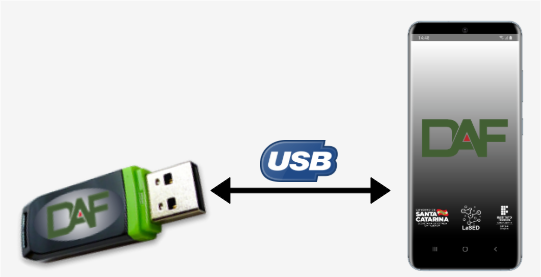
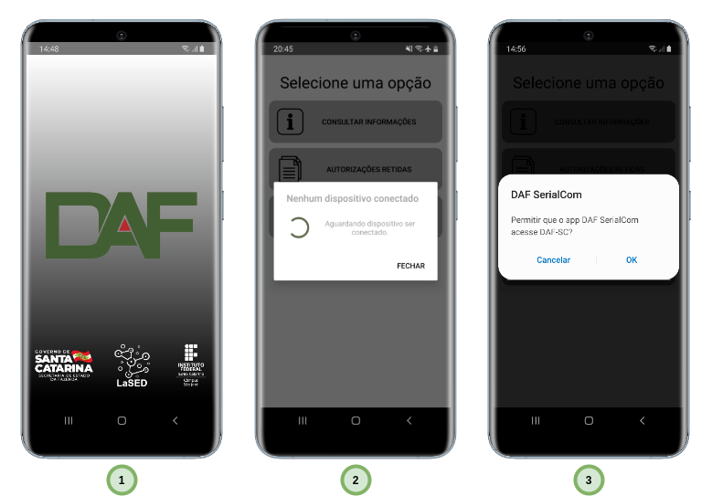

[](https://www.gnu.org/licenses/gpl-3.0)

> # Aviso de isenção de responsabilidade
>
>A presente prova de conceito (POC) é um artefato fruto do Contrato de Encomenda Tecnológica nº 001/2020, firmado entre a Secretaria de Estado da Fazenda de Santa Catarina e o Instituto Federal de Santa Catarina - IFSC.
>
>O objetivo desta prova de conceito é restrito aos objetivos contratados entre a SEF e o IFSC, compatível apenas com a versão 1.0.0 da especificação técnica de requisitos do DAF. Este artefato não tem como objetivo implementar completamente todos os processos de negócio previstos na especificação, visto que seu intuito foi demonstrar a viabilidade de implementação, tanto do DAF quanto da integração entre o PAF, DAF e a SEF-SC, utilizando tecnologias amplamente adotadas pelo mercado de desenvolvimento de software.
>
>Não cabe à SEF ou ao IFSC prestar suporte sobre os componentes, códigos ou excertos de código disponíveis nesta POC, sendo a presente versão considerada final, sem previsão de alterações, correção de bugs ou melhorias.
>
>A SEF e o IFSC eximem-se de qualquer responsabilidade, direta ou indireta, por perdas ou danos, comprovadamente ou alegadamente, causados pelos artefatos disponibilizados nesta POC. Caso deseje usar os componentes e softwares aqui disponibilizados, você estará fazendo isto exclusivamente por sua conta e risco.

# Aplicativo Android Consulta DAF

**Consulta DAF** é um aplicativo para dispositivos Android que pode ser usado para enviar comandos para qualquer DAF que esteja de acordo com a [Especificação 1.0.0 do Dispositivo Autorizador Fiscal (DAF)](https://www.sef.sc.gov.br/arquivos_portal/servicos/136/DAF_Especificacao_de_Requisitos_1.0.0.pdf). Caso queira ver o funcionamento do aplicativo **Consulta DAF** , você poderá usar o  [DAF-pi](https://github.com/ifsc-lased/daf-pi), que é uma implementação do DAF em Python3 para ser executada exclusivamente em uma [Raspberry Pi Zero W](https://www.raspberrypi.org/products/raspberry-pi-zero-w/). 



Este aplicativo foi desenvolvido na linguagem Java e com o IDE [Android Studio](https://developer.android.com/studio). Para executá-lo é necessário que tenha um telefone com Android 9 ou superior e o mesmo deverá prover suporte a especificação [USB OTG](https://pt.wikipedia.org/wiki/USB_On-The-Go). Para obter o código fonte contido neste repositório, execute o comando abaixo:

```bash
git clone https://github.com/ifsc-lased/daf-app
```
## Funcionalidades do aplicativo

Ao abrir o Consulta DAF, ele tentará automaticamente encontrar um DAF conectado na porta USB do dispositivo (passo 2 da figura abaixo) e quando isso acontecer, o usuário deverá autorizar o Consulta DAF a acessar a interface de comunicação serial com o DAF (passo 3 da figura abaixo). 



Com o aplicativo é possível realizar as seguintes ações:

- **Consultar informações**
  - Retornar as informações essenciais do DAF, como: identificador único do DAF, modo de operação, versão do software básico, fabricante, modelo, valor atual do contador monotônico, certificado digital da SEF, etc. 
- **Descarregar informações de autorizações retidas sobre Documentos Fiscais Eletrônicos (DF-e)**
  - Permite ver quais autorizações estão retidas no DAF, apresentando inclusive o fragmento essencial do documento XML do DF-e
- **Depurar mensagens trocadas entre o aplicativo móvel e o DAF** 
  - Permite visualizar a troca de mensagens JSON para o pedido de **Consultar Informação**. Essa funcionalidade poderia ser estendida para permitir, por exemplo, o usuário fornecer manualmente a mensagem que o Consulta DAF deveria enviar ao DAF. 

Logo abaixo é demonstrado o funcionamento do aplicativo.

<p align="center">

</p>

## Limitações conhecidas

### Valor do *timeout* da camada ARQ do protocolo de comunicação

Para que seja possível fazer a comunicação entre este aplicativo móvel e o [DAF-pi](https://https://github.com/ifsc-lased/daf-pi), o valor do timeout da camada ARQ do protocolo de comunicação do DAF deste aplicativo é de **2 segundos**, em desacordo com a [Especificação 1.0.0 do Dispositivo Autorizador Fiscal (DAF)](https://www.sef.sc.gov.br/arquivos_portal/servicos/136/DAF_Especificacao_de_Requisitos_1.0.0.pdf). Esta mudança não impacta na comunicação entre o aplicativo e os demais DAFs.

## Dependências e bibliotecas de terceiros

Este projeto foi desenvolvido com o auxílio da seguinte biblioteca de terceiros:

| Biblioteca |Função| Licença |
|------------|------|---------|
|[UsbSerial](hhttps://github.com/felHR85/UsbSerial)|Comunicação USB Serial|[MIT](https://github.com/felHR85/UsbSerial/blob/master/LICENSE)|

## Imagens de terceiros

Os ícones deste projeto foram produzidos por [Vignesh Oviyan](https://www.flaticon.com/br/autores/vignesh-oviyan), [Freepik](https://www.freepik.com) e [surang](https://www.flaticon.com/br/autores/surang) e foram obtidos em [Flaticon](https://www.flaticon.com/br/).

